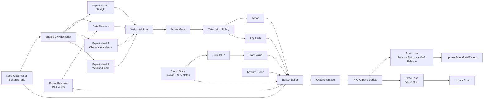

# M-MAPPO (MAPPO+MoE) Basic Architecture

```mermaid
flowchart LR
    %% ===== Inputs =====
    O[Local Observation\n3-channel grid] --> ENC[Shared CNN Encoder]
    F[Expert Features\n19-d vector] --> GATE[Gate Network]
    ENC --> GATE

    %% ===== MoE Actor =====
    ENC --> E0[Expert Head 0\nStraight]
    ENC --> E1[Expert Head 1\nObstacle Avoidance]
    ENC --> E2[Expert Head 2\nYielding/Game]
    E0 --> MIX[Weighted Sum]
    E1 --> MIX
    E2 --> MIX
    GATE --> MIX

    MIX --> MASK[Action Mask]
    MASK --> DIST[Categorical Policy]
    DIST --> ACT[Action]
    DIST --> LOGP[Log Prob]

    %% ===== Critic =====
    GS[Global State\nLayout + AGV states] --> CRITIC[Critic MLP]
    CRITIC --> V[State Value]

    %% ===== Rollout / Update =====
    ACT --> BUF[Rollout Buffer]
    LOGP --> BUF
    V --> BUF
    O --> BUF
    F --> BUF
    GS --> BUF
    R[Reward, Done] --> BUF

    BUF --> GAE[GAE Advantage]
    GAE --> PPO[PPO Clipped Update]
    PPO --> ACTORLOSS[Actor Loss\nPolicy + Entropy + MoE Balance]
    PPO --> CRITICLOSS[Critic Loss\nValue MSE]
    ACTORLOSS --> PARAM[Update Actor/Gate/Experts]
    CRITICLOSS --> PARAM2[Update Critic]
```

